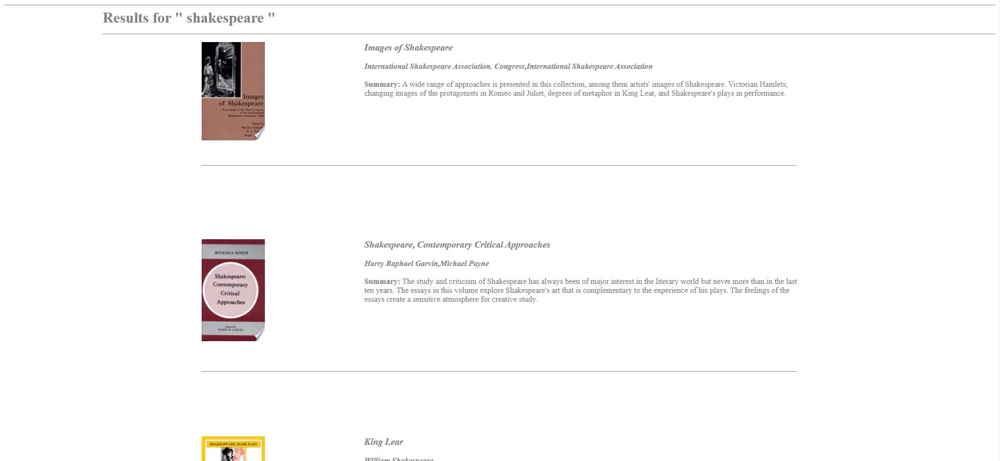
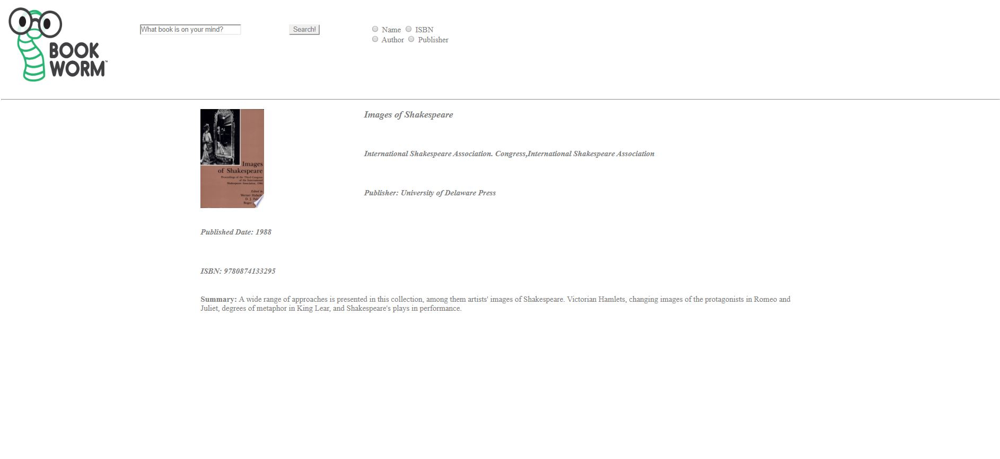
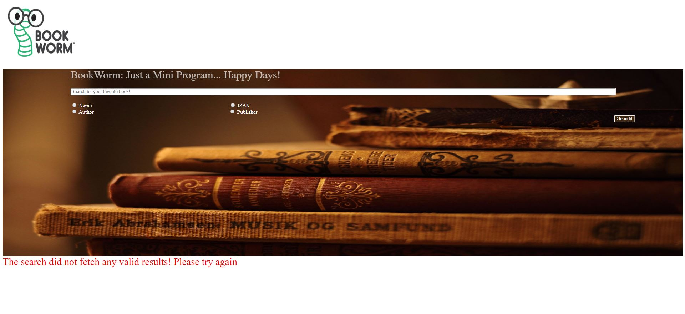

# BookWorm, a book search app for avid readers!
This is a simple demo using the Google Books API implementing Search on Author / Publisher / Book Name / ISBN Code.

## Home Page
The user can search the catalog using the above search criteria. If no option is selected, the search is performed on all 4 categories by default. Clicking the bookworm image from any other page redirects to the home page 

## Search Results Page
The results page lists down the Image, Summary & Author(s) of the books.
The image of the books is clickable and redirects to the book details page.

## Book Details Page
This page provides additional nformation about a book such as the publisher, publish date & ISBN code.
Clicking the book image again redirects back to the results page.

The user can also perform a new search using the search bar which is re-placed at the top of the page.

## Error handling
Incase of invalid queries or no search results, the error message notifies the user of it.

### To run the project in Eclipse
You will require javax.servlet.jar, and Tomcat 9.0 or +

